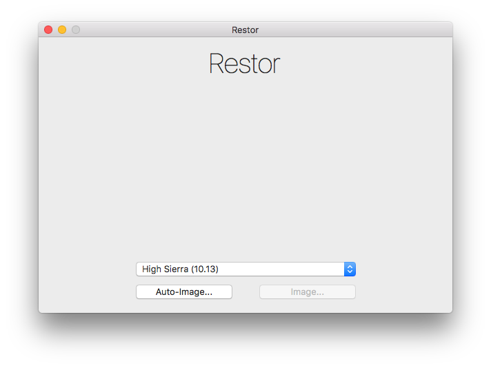
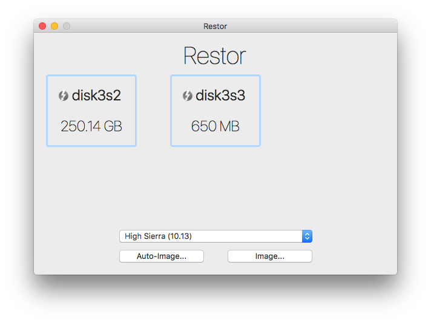
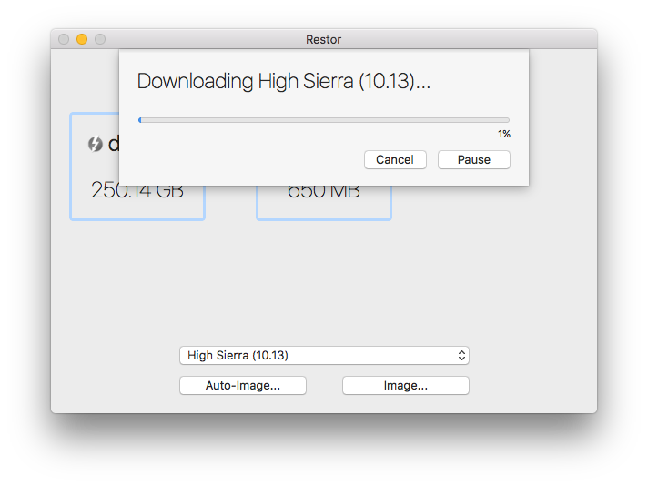
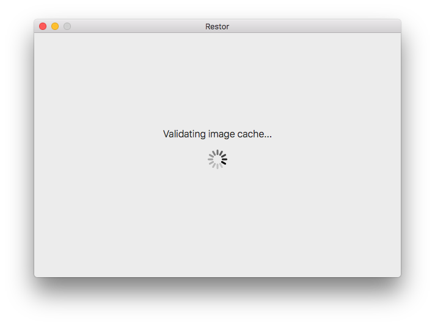
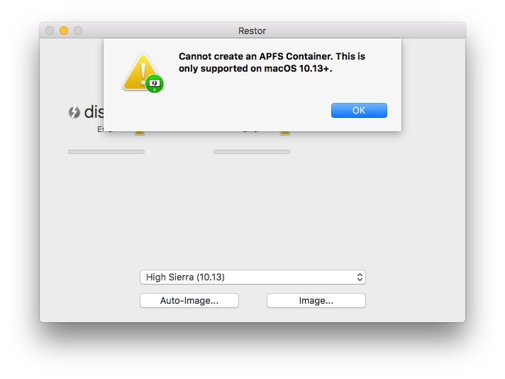

# Restor

Restor is a user-friendly application to (mass) image macOS computers from a
single source. It is an application intended to be run interactively on a
machine.

<p align="center">
<a href="#restor--">

</a>
</p>

You can attach the machine-to-be-imaged via Thunderbolt or USB to the machine
running Restor.

<p align="center">
<a href="#restor_disk_choice--">

</a>
</p>

Restor will cache an image once it has been downloaded for future use, and will
validate the image via SHA256. Only if the signature has changed, will the image
be downloaded again.

<p align="center">
<a href="#restor_progress--">

</a>
</p>

<p align="center">
<a href="#restor_validate--">

</a>
</p>

# Example Configuration

Restor has two configurable features: `ConfigURL` and `CustomImage`.

### ConfigURL

__Required__

Set the `ConfigURL` preference to point at a plist containing the images to be
used.

`sudo defaults write /Library/Preferences/com.google.corp.restor.plist ConfigURL "http://server/images.plist"`

The following format for the plist is required:

```xml
<?xml version="1.0" encoding="UTF-8"?>
<!DOCTYPE plist PUBLIC "-//Apple//DTD PLIST 1.0//EN" "http://www.apple.com/DTDs/PropertyList-1.0.dtd">
<plist version="1.0">
<dict>
	<key>Images</key>
	<array>
		<dict>
			<key>Name</key>
			<string>Sierra (10.12) All Models</string>
			<key>URL</key>
			<string>http://server/10.12.6.dmg</string>
			<key>SHA-256</key>
			<string>ffffffffffffffffffffffffffffffffffffffffffffffffffffffffffffffff</string>
		</dict>
	</array>
</dict>
</plist>
```

### CustomImage

__Optional__

Set the `CustomImage` preference to toggle the use of a local custom image.

`sudo defaults write /Library/Preferences/com.google.corp.restor.plist CustomImage -bool true`

## 10.13 and APFS Note

In order to restore an APFS 10.13 DMG to a machine, the host machine running
Restor must also be upgraded to High Sierra 10.13. Otherwise, you will receive
an error when attempting to image the machine.

<p align="center">
<a href="#restor_apfs_error--">

</a>
</p>

## Contributing

Patches to this library are very much welcome. Please see the
[CONTRIBUTING](https://github.com/google/restor/blob/master/CONTRIBUTING.md)
file.
